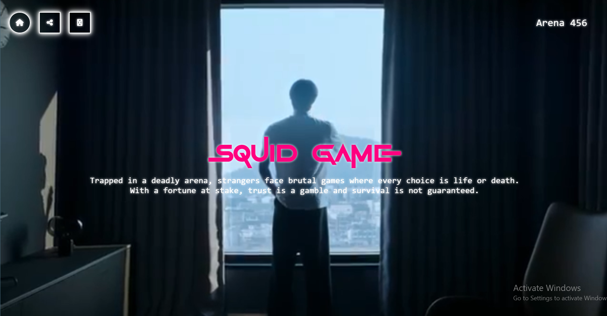
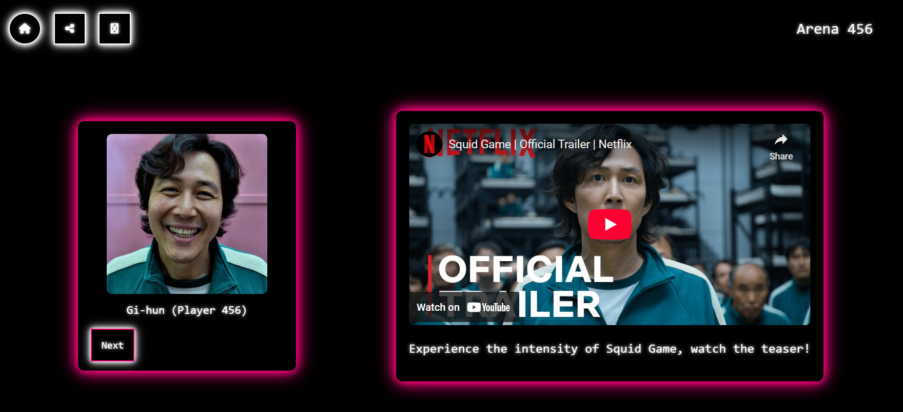
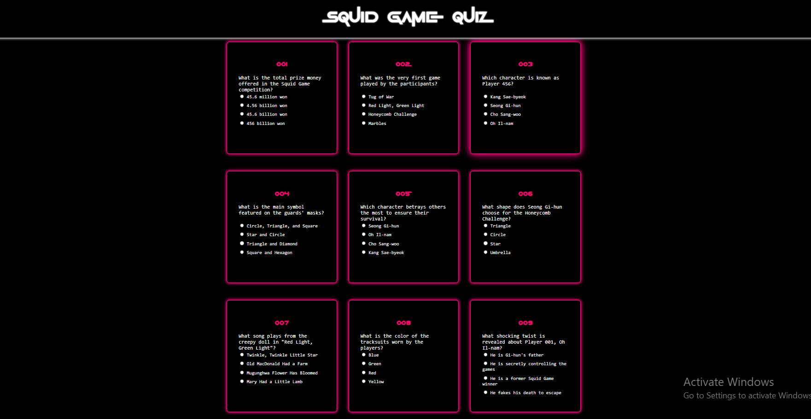
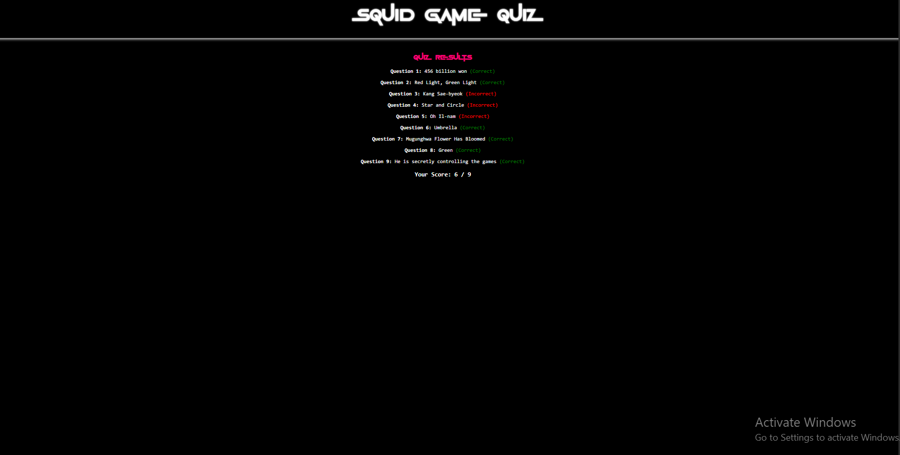

# Arena 456

**Arena 456** is a browser-based interactive project inspired by *Squid Game*.
It combines cinematic visuals, character showcases, embedded media, and a quiz system to create an engaging web experience.

<p align="center">
  
</p>

---

## Project Overview

**Objective:**

* Recreate the immersive feel of *Squid Game* through web technologies.
* Design a neon-styled UI with interactive features.
* Implement a working quiz system that evaluates users in real-time.

**Core Features:**

* **Cinematic Landing Page** with video background and neon UI.
* **Character Highlights** showcasing Gi-hun, Il-nam, and Sae-byeok.
* **Embedded Trailer** viewable directly on the site.
* **Interactive Quiz System** with scoring and feedback.
* **Form Section** before the quiz for user interaction.
* **Game-Inspired Buttons** (Circle, Triangle, Square) with different actions:

  * One links to Netflix to watch the series.
  * One returns users to the homepage.
  * One displays a message ("Share this site with your friends") — currently a placeholder for a future share feature.

---

## Key Components & Functionality

1️ **Frontend Design & Aesthetics**

* Neon-inspired interface designed with custom CSS.
* Integration of Google Fonts + custom Squid Game font.

2️ **Interactivity with JavaScript**

* Navigation & character switching logic.
* Quiz scoring with instant results.
* Circle, Triangle, and Square buttons coded with unique behaviors.

3️ **Media Integration**

* Video embeds and styled images to enhance the experience.
* Trailer integration for cinematic feel.

---

## Project Structure

```
Arena 456/
│── index.html         # Landing page
│── quiz.html          # Quiz page
│── script.js          # Navigation + quiz logic
│── styles.css         # Neon theme & animations
│── fonts/             # Custom GameOfSquids.ttf
│── assets/            # Images & videos
```

---

## Tools & Technologies

* **HTML5** – Layout & structure
* **CSS3** – Neon-themed styling, custom fonts, animations
* **JavaScript (Vanilla)** – Quiz logic, navigation, button actions
* **Font Awesome** – Icons
* **Google Fonts + Custom Fonts** – Typography

---

## Future Improvements

* Add a leaderboard system for quiz results.
* Expand question bank with multiple difficulty levels.
* Improve responsiveness across all devices.
* Add smooth animations for character cards.
* Implement a working **share feature** to replace the placeholder message.

---

## How to Run

1. Clone the repository:

   ```bash
   https://github.com/rawahazkhan/Arena-456.git
   ```
2. Open `index.html` in your browser.
3. Explore the landing page, characters, quiz, and interactive features.

---

 Screenshots

- **Character Showcase** 


- **Quiz Section** 



**Thank you for exploring this project!**